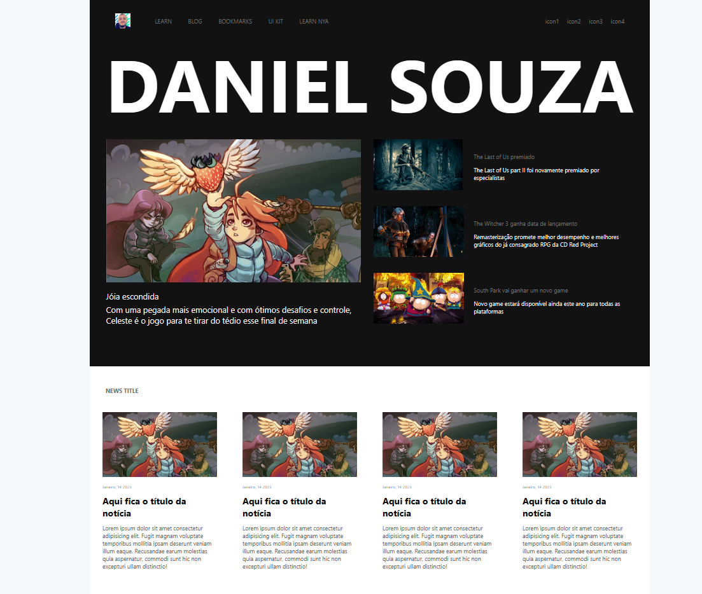

# Blog Page developed with Angular 16.2.6

## Table of contents

- [Overview](#overview)
  - [The challenge](#the-challenge)
  - [Screenshots](#screenshots)
  - [Links](#links)
- [My process](#my-process)
  - [Built with](#built-with)
  - [What I learned](#what-i-learned)
  - [Continued development](#continued-development)
  - [Useful resources](#useful-resources)
- [Author](#author)

## Overview

### The challenge

Users should be able to:

- View and select generated news about some games;
- Access dynamic pages by click in the links of the home page;
- See commom components in every page;

### Screenshots



### Links

- Solution URL: [GithHub Repository](https://github.com/danielrsouza10/angular-blog)

## My process

### Built with

- Angular
- TypeScript
- Semantic HTML5 markup
- Semantic HTML5 markup
- CSS custom properties

### What I learned

- Angular components;
- Angular Routes;
- Relational Database;
- Improve functions on - TypeScript;
- Development of good components;
- Fetch os dynamic informations to put on the pages.

```Ts
  constructor(private route: ActivatedRoute) {}

  ngOnInit(): void {
    this.route.paramMap.subscribe((value) => {
      this.id = value.get('id');
    });
    this.setValuesToComponent(this.id);
  }

  setValuesToComponent(id: string | null) {
    const result = dataFake.filter((article) => article.id == id)[0];
    this.contentTitle = result.title;
    this.contentImage = result.photo;
    this.contentDescription = result.description;
  }
```

```Html
<div ngClass="black-container">
  <app-menu-title></app-menu-title>
  <div ngClass="card-container">
    <div ngClass="big-card-style">
      <app-big-card
        id="1"
        cardImage="./assets/celeste-game.jpg"
        cardTitle="Jóia escondida"
        cardDescription="Com uma pegada mais emocional e com ótimos desafios e controle, Celeste é o jogo para te tirar do tédio esse final de semana"
      ></app-big-card>
    </div>
    <div ngClass="small-card-style">
      <app-small-card
        id="2"
        cardImage="https://th.bing.com/th/id/OIP.eGQuPs5deEGRXEfxfWE6tQHaEK?w=317&h=180&c=7&r=0&o=5&dpr=1.5&pid=1.7"
        cardTitle="The Last of Us premiado"
        cardDescription="The Last of Us part II foi novamente premiado por especialistas"
      ></app-small-card>
      <app-small-card
        id="3"
        cardImage="https://th.bing.com/th/id/OIP.dz72DuoAyz-aC6ajD5QCzgHaEK?pid=ImgDet&rs=1"
        cardTitle="The Witcher 3 ganha data de lançamento"
        cardDescription="Remasterização promete melhor desempenho e melhores gráficos do já consagrado RPG da CD Red Project"
      ></app-small-card>
      <app-small-card
        id="4"
        cardImage="https://th.bing.com/th/id/OIP.EjP2MedjTR-7Pduf_lJseQHaEK?pid=ImgDet&rs=1"
        cardTitle="South Park vai ganhar um novo game"
        cardDescription="Novo game estará disponível ainda este ano para todas as plataformas"
      ></app-small-card>
    </div>
  </div>
</div>
<div ngClass="white-container">
  <app-news-title></app-news-title>
  <div ngClass="bottom-news-container">
    <app-news-card></app-news-card>
    <app-news-card></app-news-card>
    <app-news-card></app-news-card>
    <app-news-card></app-news-card>
  </div>
</div>

```

### Continued development

- Mobile responsive design
- Import news from a API's
- More dynamic pages from this project.

### Useful resources

- [DIO](https://www.dio.me/) - This helped me with Angular routes.

## Author

- Website - [Linkedin](https://www.linkedin.com/in/danielrsouza/)
- Instagram - [@danielrsouza](https://www.instagram.com/danielrsouza)
